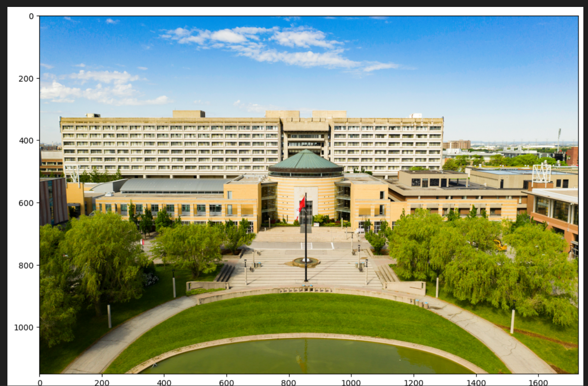

## Canny Edge Detection & Seam Carving

The following project implements the canny edge detection algorithm and seam carving function that resizes images in a manner that preserves "important" image content.
Pythons Pytorch, kornia, matplotlib and cv2 libs were used.

original image before resizing:

image resized horizontally:

image resized vertically:

